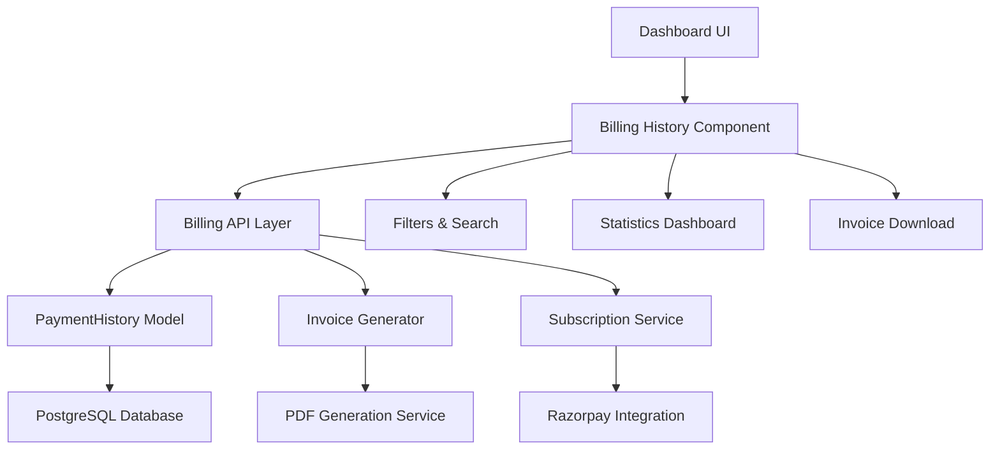

# Billing History Tracking Design

## Overview

The billing history tracking system will provide users with comprehensive visibility into their payment transactions, subscription changes, and billing details. The system will integrate seamlessly with the existing eProfile dashboard and leverage the current PaymentHistory model while extending functionality for enhanced user experience.

## Architecture

### System Components



### Data Flow

1. **Payment Processing**: When payments are processed via Razorpay, records are stored in PaymentHistory
2. **Data Retrieval**: Billing API fetches payment records with filtering and pagination
3. **UI Rendering**: React components display formatted billing data with responsive design
4. **Invoice Generation**: On-demand PDF generation for payment receipts
5. **Statistics Calculation**: Real-time computation of billing summaries and trends

## Components and Interfaces

### 1. Database Schema Extensions

The existing `PaymentHistory` model will be enhanced with additional fields:

```typescript
model PaymentHistory {
  id        String   @id @default(cuid())
  userId    String
  paymentId String   @unique
  orderId   String
  amount    Int      // Amount in paise
  currency  String   @default("INR")
  status    String
  plan      String
  createdAt DateTime @default(now())

  // New fields for enhanced tracking
  paymentMethod String?  // "card", "upi", "netbanking", etc.
  cardLast4     String?  // Last 4 digits of card
  description   String?  // Human-readable description
  invoiceUrl    String?  // Generated invoice URL
  refundAmount  Int?     // Refund amount if applicable
  refundedAt    DateTime? // Refund timestamp

  user User @relation(fields: [userId], references: [id], onDelete: Cascade)

  @@map("payment_history")
}
```

### 2. API Endpoints

#### GET /api/billing/history

```typescript
interface BillingHistoryRequest {
  page?: number;
  limit?: number;
  startDate?: string;
  endDate?: string;
  status?: "all" | "successful" | "failed" | "refunded";
  plan?: "all" | "STANDARD" | "PRO";
}

interface BillingHistoryResponse {
  payments: PaymentRecord[];
  pagination: {
    page: number;
    limit: number;
    total: number;
    totalPages: number;
  };
  summary: BillingSummary;
}
```

#### GET /api/billing/statistics

```typescript
interface BillingStatistics {
  totalSpent: number;
  totalPayments: number;
  averagePayment: number;
  subscriptionDuration: number; // in days
  planBreakdown: {
    [plan: string]: {
      count: number;
      totalAmount: number;
    };
  };
  monthlySpending: Array<{
    month: string;
    amount: number;
    payments: number;
  }>;
}
```

#### GET /api/billing/invoice/[paymentId]

```typescript
interface InvoiceRequest {
  paymentId: string;
}

// Returns PDF buffer or invoice URL
```

### 3. React Components

#### BillingHistoryManager

Main container component that orchestrates the billing history display:

```typescript
interface BillingHistoryManagerProps {
  className?: string;
}

interface BillingHistoryState {
  payments: PaymentRecord[];
  loading: boolean;
  error: string | null;
  filters: BillingFilters;
  pagination: PaginationState;
  statistics: BillingStatistics | null;
}
```

#### PaymentHistoryTable

Responsive table component for displaying payment records:

```typescript
interface PaymentHistoryTableProps {
  payments: PaymentRecord[];
  loading: boolean;
  onInvoiceDownload: (paymentId: string) => void;
  onRefresh: () => void;
}
```

#### BillingFilters

Filter and search component:

```typescript
interface BillingFiltersProps {
  filters: BillingFilters;
  onFiltersChange: (filters: BillingFilters) => void;
  onReset: () => void;
}
```

#### BillingStatistics

Statistics dashboard component:

```typescript
interface BillingStatisticsProps {
  statistics: BillingStatistics;
  loading: boolean;
}
```

#### InvoiceDownloadButton

Component for downloading invoices:

```typescript
interface InvoiceDownloadButtonProps {
  paymentId: string;
  amount: number;
  date: string;
  disabled?: boolean;
}
```

## Data Models

### PaymentRecord Interface

```typescript
interface PaymentRecord {
  id: string;
  paymentId: string;
  orderId: string;
  amount: number;
  currency: string;
  status: "captured" | "failed" | "refunded";
  plan: "STANDARD" | "PRO";
  paymentMethod?: string;
  cardLast4?: string;
  description: string;
  createdAt: string;
  refundAmount?: number;
  refundedAt?: string;
  invoiceUrl?: string;
}
```

### BillingFilters Interface

```typescript
interface BillingFilters {
  dateRange: {
    startDate: string | null;
    endDate: string | null;
  };
  status: "all" | "successful" | "failed" | "refunded";
  plan: "all" | "STANDARD" | "PRO";
  searchQuery: string;
}
```

### BillingSummary Interface

```typescript
interface BillingSummary {
  totalAmount: number;
  totalPayments: number;
  successfulPayments: number;
  failedPayments: number;
  refundedPayments: number;
  averagePayment: number;
  lastPaymentDate: string | null;
}
```

## Error Handling

### API Error Responses

```typescript
interface BillingError {
  code:
    | "UNAUTHORIZED"
    | "NOT_FOUND"
    | "INVALID_FILTERS"
    | "INVOICE_GENERATION_FAILED";
  message: string;
  details?: any;
}
```

### Client-Side Error Handling

- Network errors: Retry mechanism with exponential backoff
- Invalid filters: Reset to default values with user notification
- Invoice generation failures: Fallback to basic receipt view
- Empty states: Appropriate messaging for no payment history

### Error Recovery Strategies

1. **Graceful Degradation**: Show cached data when API fails
2. **Retry Logic**: Automatic retry for transient failures
3. **User Feedback**: Clear error messages with actionable steps
4. **Fallback UI**: Skeleton loading states and empty state illustrations

## Testing Strategy

### Unit Tests

- **API Endpoints**: Test all billing API routes with various filter combinations
- **Data Transformations**: Verify payment record formatting and calculations
- **Filter Logic**: Test date range, status, and plan filtering
- **Statistics Calculations**: Validate billing summary computations

### Integration Tests

- **Database Operations**: Test PaymentHistory CRUD operations
- **Razorpay Integration**: Mock payment webhook processing
- **PDF Generation**: Test invoice creation and download
- **Authentication**: Verify user access controls

### Component Tests

- **BillingHistoryManager**: Test state management and data flow
- **PaymentHistoryTable**: Test responsive rendering and interactions
- **BillingFilters**: Test filter state and validation
- **InvoiceDownloadButton**: Test download functionality

### End-to-End Tests

- **Complete Billing Flow**: From payment to history display
- **Filter and Search**: Test user interactions with filters
- **Invoice Download**: Test PDF generation and download
- **Mobile Responsiveness**: Test on various screen sizes

## UI/UX Design Patterns

### Responsive Design

- **Mobile-First**: Optimized for mobile devices with touch-friendly interactions
- **Progressive Enhancement**: Enhanced features for larger screens
- **Consistent Spacing**: Following existing mobile-container and mobile-card patterns

### Visual Hierarchy

- **Status Indicators**: Color-coded payment status (green=success, red=failed, orange=refunded)
- **Typography**: Consistent with existing responsive-text-\* classes
- **Icons**: Meaningful icons for payment methods and actions

### Loading States

- **Skeleton Loading**: Using existing SkeletonBase components
- **Progressive Loading**: Load critical data first, then enhancements
- **Optimistic Updates**: Immediate UI feedback for user actions

### Empty States

- **No Payments**: Encouraging message with upgrade CTA
- **No Results**: Clear messaging when filters return no results
- **Error States**: Helpful error messages with recovery actions

## Performance Considerations

### Data Loading

- **Pagination**: Load 20 records per page by default
- **Lazy Loading**: Load additional data on scroll or page navigation
- **Caching**: Cache frequently accessed data in React state

### Database Optimization

- **Indexing**: Add indexes on userId, createdAt, and status fields
- **Query Optimization**: Use efficient queries with proper joins
- **Connection Pooling**: Leverage existing Prisma connection management

### Client-Side Performance

- **Memoization**: Use React.memo for expensive components
- **Virtual Scrolling**: For large payment lists (future enhancement)
- **Debounced Search**: Prevent excessive API calls during search

## Security Considerations

### Data Access Control

- **User Isolation**: Users can only access their own payment history
- **Authentication**: Require valid session for all billing endpoints
- **Authorization**: Verify user permissions before data access

### Sensitive Data Handling

- **PII Protection**: Mask sensitive payment information
- **Audit Logging**: Log access to billing information
- **Data Retention**: Follow compliance requirements for payment data

### Invoice Security

- **Secure URLs**: Use signed URLs for invoice downloads
- **Access Control**: Verify user ownership before serving invoices
- **Data Sanitization**: Ensure invoice data is properly sanitized

## Integration Points

### Existing Systems

- **Subscription Provider**: Integrate with existing subscription context
- **Payment Verification**: Leverage existing Razorpay integration
- **Dashboard Layout**: Follow existing dashboard navigation patterns
- **API Client**: Use existing apiClient for consistent error handling

### External Services

- **Razorpay API**: Fetch additional payment details when needed
- **PDF Generation**: Use server-side PDF generation library
- **Email Service**: Future integration for invoice delivery

## Future Enhancements

### Phase 2 Features

- **Export Functionality**: CSV/Excel export of payment history
- **Email Invoices**: Automatic invoice delivery via email
- **Payment Reminders**: Automated reminders for failed payments
- **Subscription Analytics**: Detailed subscription usage analytics

### Advanced Features

- **Multi-Currency Support**: Handle payments in different currencies
- **Tax Calculations**: Automatic tax computation and reporting
- **Bulk Operations**: Bulk invoice downloads and exports
- **Advanced Filtering**: More granular filtering options
