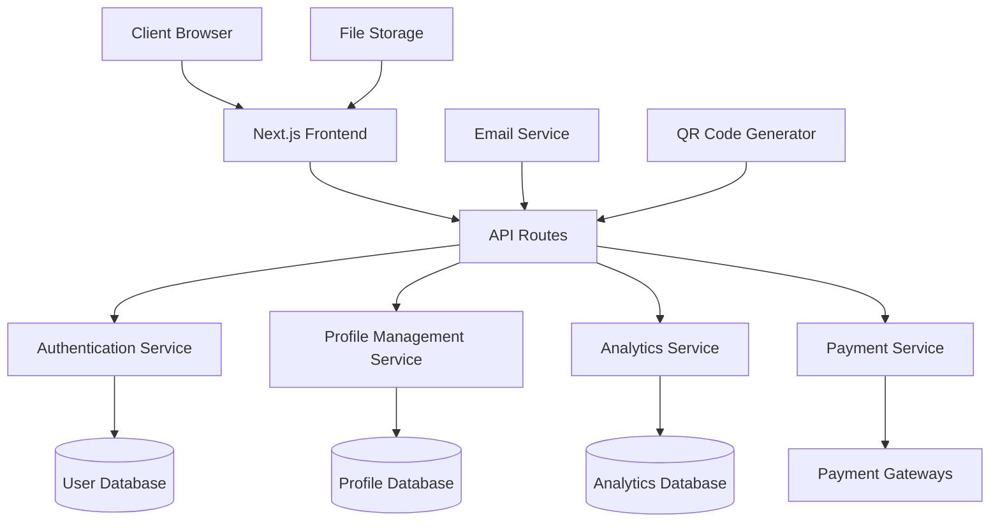

# Design Document

## Overview

The eProfile Platform is a modern web application built with Next.js that enables professionals to create, customize, and share digital business cards. The platform follows a freemium model with basic features available for free and advanced features requiring a premium subscription.

The system architecture emphasizes performance, SEO optimization, and scalability to support thousands of users while maintaining fast load times for eProfiles - crucial for professional first impressions.

## Architecture

### High-Level Architecture



### Technology Stack

**Frontend:**

- Next.js 14+ with App Router for optimal SEO and performance
- TypeScript for type safety
- Tailwind CSS for responsive design
- React Hook Form for form management
- Framer Motion for smooth animations

**Backend:**

- Next.js API Routes for serverless functions
- Prisma ORM for database management
- NextAuth.js for authentication
- Zod for data validation

**Database:**

- PostgreSQL for relational data (users, profiles, analytics)
- Redis for caching and session management

**External Services:**

- Cloudinary for image storage and optimization
- Resend for email notifications
- Razorpay/Stripe for payment processing
- Google Analytics for tracking

**Deployment:**

- Vercel for hosting (optimal Next.js integration)
- Vercel Edge Functions for global performance

## Components and Interfaces

### Core Components

#### 1. Authentication System

- **Google OAuth Integration**: Seamless login with Google accounts
- **Email/Password Authentication**: Traditional registration option
- **Session Management**: Secure JWT-based sessions with refresh tokens
- **Role-Based Access**: Free vs Premium user permissions

#### 2. Profile Builder Interface

- **Drag-and-Drop Editor**: Intuitive profile customization
- **Live Preview**: Real-time updates as users edit
- **Template Selector**: Grid of professional templates
- **Media Upload**: Image optimization and cropping tools
- **Form Validation**: Real-time validation with helpful error messages

#### 3. eProfile Renderer

- **Server-Side Rendering**: Fast initial load times
- **Mobile-First Design**: Responsive across all devices
- **Progressive Web App**: Offline capability and app-like experience
- **SEO Optimization**: Dynamic meta tags for social sharing

#### 4. Analytics Dashboard

- **Chart Components**: Interactive data visualizations
- **Real-time Updates**: Live visitor tracking
- **Export Functionality**: PDF/CSV report generation
- **Date Range Filtering**: Flexible time period analysis

### API Interface Design

#### Authentication Endpoints

```typescript
POST / api / auth / register;
POST / api / auth / login;
POST / api / auth / logout;
GET / api / auth / session;
```

#### Profile Management Endpoints

```typescript
GET /api/cards/[username] - Public profile data
POST /api/cards - Create new profile
PUT /api/cards/[id] - Update profile
DELETE /api/cards/[id] - Delete profile
GET /api/cards/[id]/analytics - Profile analytics
```

#### Lead Management Endpoints

```typescript
POST /api/leads - Submit lead form
GET /api/leads/[cardId] - Get profile leads
PUT /api/leads/[id]/status - Update lead status
```

## Data Models

### User Model

```typescript
interface User {
  id: string;
  email: string;
  name: string;
  avatar?: string;
  subscription: "FREE" | "PRO";
  subscriptionExpiry?: Date;
  createdAt: Date;
  updatedAt: Date;
}
```

### Profile Model

```typescript
interface Card {
  id: string;
  userId: string;
  username: string; // Unique URL identifier
  title: string;
  subtitle: string;
  bio: string;
  profileImage?: string;
  coverImage?: string;
  template: string;
  customDomain?: string;

  // Contact Information
  phone?: string;
  email?: string;
  address?: string;

  // Social Links
  socialLinks: SocialLink[];

  // Services
  services: Service[];

  // Gallery
  gallery: GalleryItem[];

  // Testimonials
  testimonials: Testimonial[];

  // Settings
  isPublic: boolean;
  seoTitle?: string;
  seoDescription?: string;

  createdAt: Date;
  updatedAt: Date;
}
```

### Lead Model

```typescript
interface Lead {
  id: string;
  cardId: string;
  name: string;
  email?: string;
  phone?: string;
  message: string;
  status: "NEW" | "CONTACTED" | "CONVERTED";
  source: string; // How they found the profile
  createdAt: Date;
}
```

### Analytics Model

```typescript
interface CardView {
  id: string;
  cardId: string;
  visitorId: string; // Anonymous visitor tracking
  referrer?: string;
  userAgent: string;
  country?: string;
  createdAt: Date;
}

interface ButtonClick {
  id: string;
  cardId: string;
  buttonType: "PHONE" | "EMAIL" | "WHATSAPP" | "LOCATION";
  createdAt: Date;
}
```

## Error Handling

### Client-Side Error Handling

- **Form Validation Errors**: Real-time field validation with clear messages
- **Network Errors**: Retry mechanisms with user feedback
- **Image Upload Errors**: File size and format validation
- **Payment Errors**: Clear error messages with suggested actions

### Server-Side Error Handling

- **API Error Responses**: Consistent error format across all endpoints
- **Database Errors**: Graceful handling with fallback options
- **External Service Failures**: Circuit breaker pattern for third-party APIs
- **Rate Limiting**: Prevent abuse with appropriate error messages

### Error Response Format

```typescript
interface ApiError {
  success: false;
  error: {
    code: string;
    message: string;
    details?: any;
  };
}
```

## Testing Strategy

### Unit Testing

- **Component Testing**: React Testing Library for UI components
- **API Testing**: Jest for API route testing
- **Utility Functions**: Pure function testing
- **Database Operations**: Prisma client testing with test database

### Integration Testing

- **Authentication Flow**: End-to-end login/registration testing
- **Profile Creation**: Complete profile building workflow
- **Payment Processing**: Mock payment gateway integration
- **Email Notifications**: Email service integration testing

### Performance Testing

- **Load Testing**: Simulate high traffic scenarios
- **Image Optimization**: Test image loading and compression
- **Database Performance**: Query optimization testing
- **CDN Performance**: Asset delivery testing

### Security Testing

- **Authentication Security**: JWT token validation
- **Input Validation**: SQL injection and XSS prevention
- **File Upload Security**: Malicious file detection
- **Rate Limiting**: API abuse prevention

## Performance Considerations

### Frontend Optimization

- **Code Splitting**: Lazy loading of non-critical components
- **Image Optimization**: Next.js Image component with WebP support
- **Caching Strategy**: Browser caching for static assets
- **Bundle Analysis**: Regular bundle size monitoring

### Backend Optimization

- **Database Indexing**: Optimized queries for profile lookups
- **Caching Layer**: Redis for frequently accessed data
- **CDN Integration**: Global asset distribution
- **API Response Optimization**: Minimal data transfer

### SEO Optimization

- **Server-Side Rendering**: Fast initial page loads
- **Dynamic Meta Tags**: Social media sharing optimization
- **Structured Data**: Schema.org markup for search engines
- **Sitemap Generation**: Automatic sitemap updates

## Security Measures

### Authentication Security

- **JWT Token Management**: Secure token storage and rotation
- **Password Hashing**: bcrypt with appropriate salt rounds
- **Session Management**: Secure session handling
- **OAuth Security**: Proper OAuth flow implementation

### Data Protection

- **Input Sanitization**: XSS and injection prevention
- **File Upload Security**: Virus scanning and file type validation
- **HTTPS Enforcement**: SSL/TLS for all communications
- **CORS Configuration**: Proper cross-origin request handling

### Privacy Compliance

- **GDPR Compliance**: User data deletion and export
- **Cookie Management**: Proper cookie consent handling
- **Data Minimization**: Collect only necessary user data
- **Audit Logging**: Track sensitive operations

## Deployment Strategy

### Development Environment

- **Local Development**: Docker containers for consistent environment
- **Database Seeding**: Test data for development
- **Environment Variables**: Secure configuration management
- **Hot Reloading**: Fast development iteration

### Staging Environment

- **Production Mirror**: Identical to production setup
- **Integration Testing**: Full system testing
- **Performance Testing**: Load testing before deployment
- **Security Scanning**: Automated vulnerability assessment

### Production Deployment

- **Vercel Deployment**: Automated CI/CD pipeline
- **Database Migrations**: Safe schema updates
- **Feature Flags**: Gradual feature rollout
- **Monitoring**: Real-time application monitoring
- **Backup Strategy**: Regular database backups

### Monitoring and Alerting

- **Application Monitoring**: Error tracking and performance metrics
- **Database Monitoring**: Query performance and connection pooling
- **User Analytics**: Usage patterns and feature adoption
- **Uptime Monitoring**: Service availability tracking
