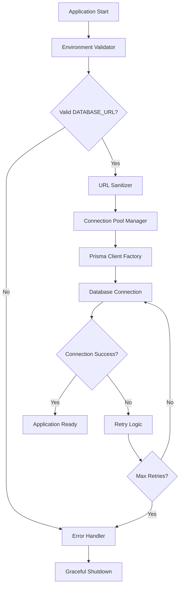
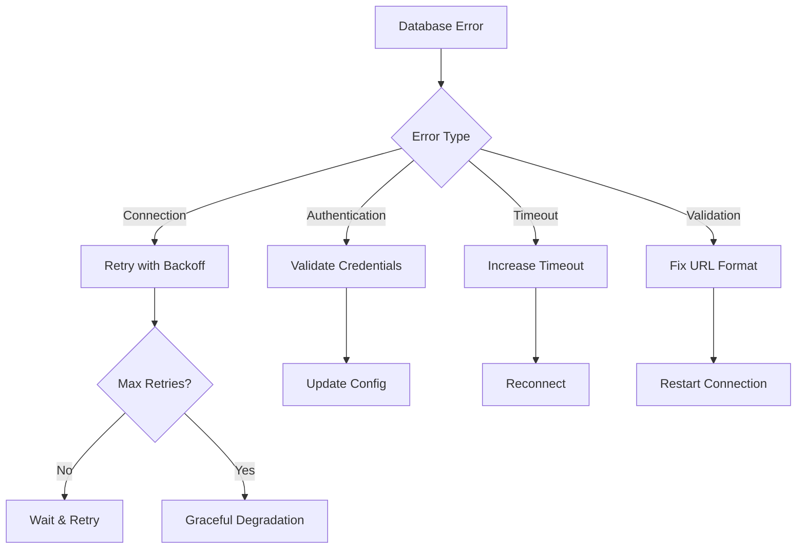

# Design Document

## Overview

This design addresses the critical database connection issues occurring in production deployment on Vercel. The root cause analysis reveals multiple issues: invalid database URL formatting, improper connection pooling configuration, missing environment variable validation, and inadequate error handling for production environments.

The solution implements a robust database connection management system with proper URL validation, environment-specific configuration, and enhanced error handling to ensure reliable database operations in production.

## Architecture

### Current Issues Identified

1. **Database URL Formatting**: The current DATABASE_URL contains special characters that need proper encoding
2. **Connection Pooling**: Missing or incorrect pgbouncer configuration for Supabase
3. **Environment Variable Validation**: No validation of DATABASE_URL format before Prisma initialization
4. **Error Handling**: Insufficient error logging and recovery mechanisms

### Proposed Architecture



## Components and Interfaces

### 1. Database URL Validator

**Purpose**: Validates and sanitizes database connection strings before use

**Interface**:

```typescript
interface DatabaseURLValidator {
  validate(url: string): ValidationResult;
  sanitize(url: string): string;
  encodeSpecialCharacters(url: string): string;
}

interface ValidationResult {
  isValid: boolean;
  errors: string[];
  warnings: string[];
}
```

**Implementation Details**:

- Validates PostgreSQL URL format
- Encodes special characters in passwords
- Checks for required parameters
- Validates SSL configuration

### 2. Environment Configuration Manager

**Purpose**: Manages environment-specific database configuration

**Interface**:

```typescript
interface EnvironmentConfig {
  getDatabaseURL(): string;
  getConnectionPoolConfig(): ConnectionPoolConfig;
  isProduction(): boolean;
  validateEnvironment(): EnvironmentValidationResult;
}

interface ConnectionPoolConfig {
  pgbouncer: boolean;
  poolTimeout: number;
  connectionLimit?: number;
  sslMode?: string;
}
```

**Implementation Details**:

- Environment-specific connection parameters
- Production-optimized connection pooling
- SSL configuration for production
- Timeout and retry configurations

### 3. Enhanced Prisma Client Factory

**Purpose**: Creates properly configured Prisma clients with error handling

**Interface**:

```typescript
interface PrismaClientFactory {
  createClient(config: DatabaseConfig): PrismaClient;
  validateConnection(client: PrismaClient): Promise<boolean>;
  handleConnectionError(error: Error): void;
}

interface DatabaseConfig {
  url: string;
  poolConfig: ConnectionPoolConfig;
  logLevel: LogLevel;
  retryConfig: RetryConfig;
}
```

**Implementation Details**:

- Environment-specific client configuration
- Connection validation and health checks
- Automatic retry logic
- Comprehensive error logging

### 4. Connection Health Monitor

**Purpose**: Monitors database connection health and handles reconnection

**Interface**:

```typescript
interface ConnectionHealthMonitor {
  startMonitoring(): void;
  checkHealth(): Promise<HealthStatus>;
  handleDisconnection(): Promise<void>;
  getMetrics(): ConnectionMetrics;
}

interface HealthStatus {
  isHealthy: boolean;
  latency: number;
  lastChecked: Date;
  errors: Error[];
}
```

## Data Models

### Environment Configuration Schema

```typescript
interface ProductionDatabaseConfig {
  // Core connection
  databaseUrl: string;

  // Connection pooling
  pgbouncer: boolean;
  poolTimeout: number;
  connectionLimit: number;

  // SSL configuration
  sslMode: "require" | "prefer" | "disable";
  sslCert?: string;

  // Retry configuration
  maxRetries: number;
  retryDelay: number;
  backoffMultiplier: number;

  // Monitoring
  healthCheckInterval: number;
  logLevel: "error" | "warn" | "info" | "debug";
}
```

### Error Classification Schema

```typescript
interface DatabaseError {
  type: "CONNECTION" | "AUTHENTICATION" | "TIMEOUT" | "VALIDATION";
  code: string;
  message: string;
  timestamp: Date;
  context: Record<string, any>;
  recoverable: boolean;
}
```

## Error Handling

### Error Categories and Responses

1. **Connection Initialization Errors**

   - Invalid DATABASE_URL format
   - Missing environment variables
   - Network connectivity issues
   - Response: Validate and sanitize URL, provide clear error messages

2. **Authentication Errors**

   - Invalid credentials
   - SSL certificate issues
   - Response: Verify credentials, check SSL configuration

3. **Runtime Connection Errors**

   - Connection pool exhaustion
   - Network timeouts
   - Database unavailability
   - Response: Implement retry logic, connection pooling

4. **Query Execution Errors**
   - SQL syntax errors
   - Constraint violations
   - Response: Proper error logging, graceful degradation

### Error Recovery Strategies



## Testing Strategy

### Unit Tests

1. **Database URL Validator Tests**

   - Valid URL formats
   - Invalid URL handling
   - Special character encoding
   - SSL parameter validation

2. **Environment Configuration Tests**

   - Environment variable loading
   - Configuration validation
   - Default value handling
   - Production vs development configs

3. **Prisma Client Factory Tests**
   - Client creation with various configs
   - Connection validation
   - Error handling scenarios
   - Retry logic testing

### Integration Tests

1. **Database Connection Tests**

   - Successful connection establishment
   - Connection pooling behavior
   - SSL connection verification
   - Timeout handling

2. **Error Recovery Tests**

   - Network interruption simulation
   - Database unavailability scenarios
   - Authentication failure handling
   - Connection pool exhaustion

3. **Production Environment Tests**
   - Supabase connection validation
   - Vercel deployment compatibility
   - Environment variable resolution
   - Performance under load

### Production Validation

1. **Health Check Endpoints**

   - Database connectivity status
   - Connection pool metrics
   - Query performance metrics
   - Error rate monitoring

2. **Monitoring and Alerting**
   - Connection failure alerts
   - Performance degradation detection
   - Error rate thresholds
   - Automated recovery triggers

## Implementation Phases

### Phase 1: Immediate Fix (Critical)

- Fix DATABASE_URL encoding issues
- Implement proper connection pooling
- Add basic error handling
- Deploy hotfix to production

### Phase 2: Enhanced Configuration (High Priority)

- Implement environment validation
- Add connection health monitoring
- Enhance error logging
- Add retry mechanisms

### Phase 3: Production Optimization (Medium Priority)

- Implement advanced connection pooling
- Add performance monitoring
- Optimize for Vercel deployment
- Add automated recovery

### Phase 4: Monitoring and Maintenance (Ongoing)

- Implement comprehensive monitoring
- Add alerting systems
- Performance optimization
- Documentation and runbooks
